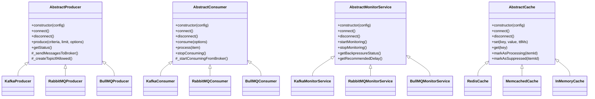

# Maestro Architecture

This document provides a comprehensive overview of the Maestro message processing system architecture, focusing on the
core abstraction layer and how it enables standardized messaging operations across different broker implementations.

## Table of Contents

1. [Core Architecture](#core-architecture)
2. [Abstract Classes](#abstract-classes)
   - [AbstractProducer](#abstractproducer)
   - [AbstractConsumer](#abstractconsumer)
   - [AbstractMonitorService](#abstractmonitorservice)
   - [AbstractCache](#abstractcache)
3. [Class Relationships & Inheritance](#class-relationships--inheritance)
4. [Message Processing Flow](#message-processing-flow)
5. [Implementation Notes](#implementation-notes)
6. [Usage Examples](#usage-examples)

## Core Architecture

Maestro is built around a set of abstract base classes that define standardized interfaces for messaging operations.
These abstractions ensure consistent behavior across different message broker implementations (Kafka, RabbitMQ, BullMQ,
etc.) while allowing for provider-specific optimizations.

The system is built on four primary abstract classes:

```
+---------------------+         +---------------------+         +----------------------+
|                     |  sends  |                     | delivers |                      |
|  AbstractProducer   |-------->|   Message Broker    |-------->|  AbstractConsumer     |
|                     | messages|  (Kafka/RabbitMQ)   | messages |                      |
| - Message Production|         |                     |         | - Message Processing  |
| - Message Suppression|        +---------------------+         | - Concurrency Control |
| - Rate Limiting     |                                         | - Error Handling      |
+-----+--------+------+                                         +--------+------+-------+
      |        |                                                         |      |
      |        |                                                         |      |
      |        |                                                         |      |
      |        |              +----------------------------+             |      |
      |        |              |                            |             |      |
      |        +------------->|      AbstractCache         |<------------+      |
      | 3. checks             |                            | 5. marks processing|
      | suppression           | - Key-Value with TTL       | 7. marks completed |
      |                       | - State Management         | 8. marks failed    |
      |                       | - Suppression Tracking     |    (low priority)  |
      |                       +----------------------------+                    |
      |                                                                         |
      |                                                                         |
      |                       +----------------------------+                    |
      |                       |                            |                    |
      |                       |     Database/Storage       |<-------------------+
      |                       |                            | 6. checks if processed
      |                       |                            | (fallback to DB lookup)
      |                       +----------------------------+                    |
      |                                                                         |
      |                                                                         |
      |        +----------------------------+                                   |
      |        |                            |                                   |
      +------->|   AbstractMonitorService   |<----------------------------------+
      9. gets  |                            | 11. monitors lag
  backpressure | - Backpressure Detection   |
     status    | - Consumer Lag Monitoring  |
               | - Adaptive Delay           |
               | - Resource Tracking        |
               |                            |
               +----------------------------+

+----------------------------+
|                            |
|   DistributedLockService   |<--------+
|                            |         |
| - Coordination             |         | 12. acquires lock
| - Lock Acquisition/Release |         | 13. releases lock
|                            |         |
+----------+-----------------+         |
           |                           |
           | 14. uses                  |
           v                           |
+----------+-----------------+         |
|                            |         |
|      AbstractCache         |---------+
| (reused from above)        |
|                            |
+----------------------------+
```

### Key Interaction Points

1. **Producer-Message Broker**: Sends messages to broker topics, creates topics when needed
2. **Consumer-Message Broker**: Consumes messages from topics, acknowledges processed messages
3. **Producer-Cache**: Checks for message suppression before sending to avoid duplicates and prioritize new messages
4. **Consumer-Cache**: Marks messages as being processed, completed, or failed
5. **Consumer-Database**: Checks if messages have been processed in persistent storage as fallback
6. **Producer-Monitor**: Gets backpressure status and applies adaptive delays
7. **Producer-DistributedLock**: Acquires and releases locks for coordinated operations

## Abstract Classes

### AbstractProducer

**Primary Responsibility**: Handles reliable message publication to broker topics with deduplication, rate-limiting, and
coordination capabilities.

#### Key Features

1. **Message Suppression**: Prevents duplicate message publication and prioritizes new messages.

   ```javascript
   // Implementation in produce() method
   if (this._enabledSuppression) {
     const isAlreadySuppressed = await this._cacheLayer.isSuppressedRecently(itemId);
     if (isAlreadySuppressed) {
       // Skip message sending
     }
   }
   ```

2. **Distributed Locks**: Coordinates message production across distributed instances.

   ```javascript
   // Implementation in produce() method
   if (this._enabledDistributedLock && this._distributedLockService) {
     await this._distributedLockService.acquire();
     // Critical section: produce messages
     await this._distributedLockService.release();
   }
   ```

3. **Adaptive Rate Limiting**: Adjusts production rate based on backpressure.
   ```javascript
   // Implementation in produce() method
   if (this._monitorService) {
     const status = await this._monitorService.getBackpressureStatus();
     if (status.level !== "NONE") {
       await new Promise(resolve => setTimeout(resolve, status.recommendedDelay));
     }
   }
   ```

#### Core Methods

- **connect()**: Establishes connection to the message broker
- **disconnect()**: Terminates connection to the message broker
- **produce(criteria, limit, options)**: Core method for sending messages
- **\_sendMessagesToBroker(messages, options)**: Abstract method for subclasses
- **getBrokerType()**: Returns the broker type identifier

### AbstractConsumer

**Primary Responsibility**: Processes messages from broker topics with concurrency control, deduplication, and
standardized business logic execution.

#### Key Features

1. **Configurable Concurrency**: Controls parallel message processing.

   ```javascript
   this.maxConcurrency =
     config.maxConcurrency ||
     parseInt(this.#getEnvironmentValue(ENV_KEYS.MAX_CONCURRENT_MESSAGES)) ||
     DEFAULT_VALUES.MAX_CONCURRENCY;
   ```

2. **Processing State Tracking**: Prevents duplicate processing via cache with database fallback.

   ```javascript
   const isAlreadyProcessed = await this._isItemProcessed(itemId);
   if (isAlreadyProcessed) {
     // Skip processing
   }
   ```

3. **Failed Message Handling**: Marks failed messages for later processing with lower priority.
   ```javascript
   await this._onItemProcessFailed(itemId, error);
   this.metrics[METRICS_PROPERTIES.TOTAL_FAILED]++;
   ```

#### Core Methods

- **connect()**: Establishes connection to the message broker
- **consume(options)**: Starts consuming messages with a business handler
- **process(item)**: Processes a single message with deduplication and error handling
- **stopConsuming()**: Stops message consumption gracefully
- **\_startConsumingFromBroker(handler, options)**: Abstract method for subclasses

### AbstractMonitorService

**Primary Responsibility**: Provides backpressure detection and mitigation recommendations to maintain system stability.

#### Key Features

1. **Multi-level Backpressure**: Categorizes system pressure into severity levels.

   ```javascript
   const BACKPRESSURE_LEVELS = {
     NONE: "NONE",
     LOW: "LOW",
     MEDIUM: "MEDIUM",
     HIGH: "HIGH",
     CRITICAL: "CRITICAL",
   };
   ```

2. **Adaptive Delays**: Calculates recommended processing delays.

   ```javascript
   const backpressureLevel = this.calculateBackpressureLevel(metrics);
   const delay =
     this.config.initialDelay *
     Math.pow(this.config.exponentialFactor, this.getBackpressureLevelValue(backpressureLevel));
   ```

3. **Resource and Lag Monitoring**: Tracks system resources and consumer lag.
   ```javascript
   const lagMetrics = await this.collectLagMetrics();
   const resourceMetrics = this.collectResourceMetrics();
   ```

#### Core Methods

- **startMonitoring()**: Begins monitoring backpressure conditions
- **calculateBackpressureLevel(metrics)**: Determines current backpressure level
- **getBackpressureStatus()**: Retrieves current metrics and recommendations
- **getRecommendedDelay()**: Calculates delay based on backpressure
- **collectCurrentMetrics()**: Collects metrics from all sources

### AbstractCache

**Primary Responsibility**: Provides unified state management and coordination facilities across different cache
implementations.

#### Key Features

1. **TTL-based Storage**: Supports time-to-live for cached items.

   ```javascript
   await this._setKeyValue(key, value, ttlMs);
   ```

2. **Processing State Management**: Tracks message processing state.

   ```javascript
   const processingKey = `${this.config.processingPrefix}${itemId}`;
   await this.set(processingKey, Date.now(), this.config.processingTtl);
   ```

3. **Suppression Management**: Implements the dual-purpose suppression mechanism.
   ```javascript
   const suppressionKey = `${this.config.suppressionPrefix}${itemId}`;
   await this.set(suppressionKey, Date.now(), this.config.suppressionTtl);
   ```

#### Core Methods

- **set(key, value, ttlMs)**: Stores a value with optional TTL
- **get(key)**: Retrieves a cached value
- **del(key)**: Deletes a cached value
- **markAsProcessing(itemId)**: Marks an item as being processed
- **markAsCompleted(itemId)**: Marks an item as successfully processed
- **markAsSuppressed(itemId)**: Marks an item for suppression/deduplication
- **markAsFailed(itemId)**: Marks an item as failed for lower-priority reprocessing

## Class Relationships & Inheritance

The abstract classes are extended by specific implementations for different message brokers:




### Class Hierarchy Details


## Message Processing Flow


## Implementation Notes

1. **Cross-Broker Coordination**: The system enables coordination across different broker implementations through the
   shared cache layer.

   ```javascript
   // Kafka producer can coordinate with RabbitMQ consumer
   const kafkaProducer = new KafkaProducer({
     topic: "orders",
     useSuppression: true,
   });

   const rabbitConsumer = new RabbitMQConsumer({
     topic: "orders",
     cacheOptions: {
       keyPrefix: "ORDERS", // Using the same Redis cache
     },
   });
   ```

2. **Abstraction Principles**:
   - All abstract classes prevent direct instantiation
   - Common configuration validation and initialization patterns across all classes
   - Environment variable overrides for key configuration parameters
   - Graceful shutdown handling for clean resource release
   - Detailed logging and metrics collection

3. **System Lifecycle**:
   - **Initialization**: Components create their dependencies
   - **Connection**: Components connect to external services
   - **Operation**: Messages flow through the system with deduplication, throttling and monitoring
   - **Shutdown**: Graceful termination and resource cleanup

## Usage Examples

```javascript
// Producer example
const { KafkaProducer } = require("@/implementations/brokers/kafka");

const producer = new KafkaProducer({
  topic: "orders",
  useSuppression: true,
  useDistributedLock: true,
  // additional kafka-specific config
});

await producer.connect();
const result = await producer.produce({ status: "new" }, 100);
await producer.disconnect();

// Consumer example
const { KafkaConsumer } = require("@/implementations/brokers/kafka");

const consumer = new KafkaConsumer({
  topic: "orders",
  maxConcurrency: 5,
  // additional kafka-specific config
});

const businessHandler = async (type, messageId, message) => {
  // Process the message
  console.log(`Processing ${type} message: ${messageId}`);
  return { success: true };
};

await consumer.connect();
await consumer.consume({ businessHandler });
// Later: await consumer.disconnect();
```
